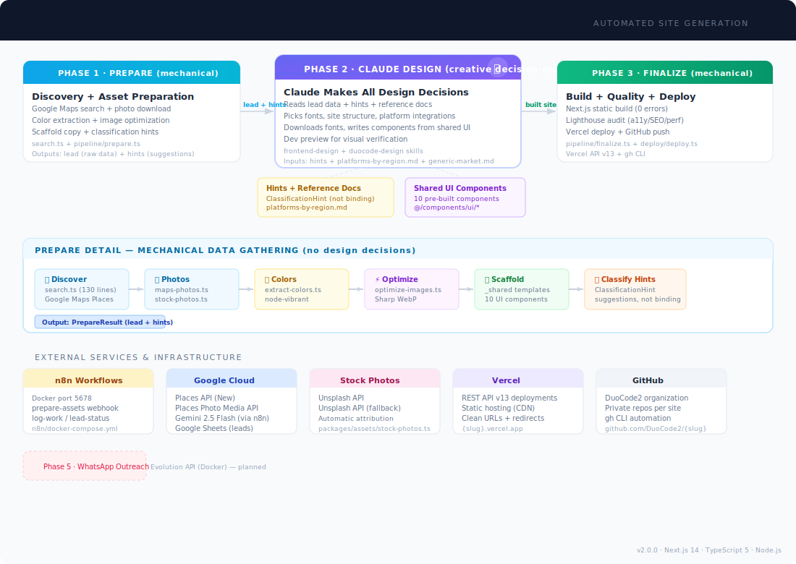
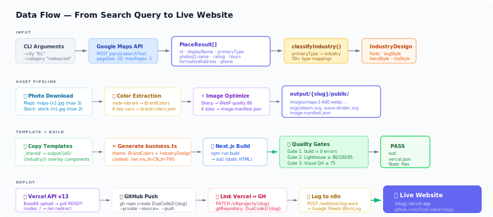
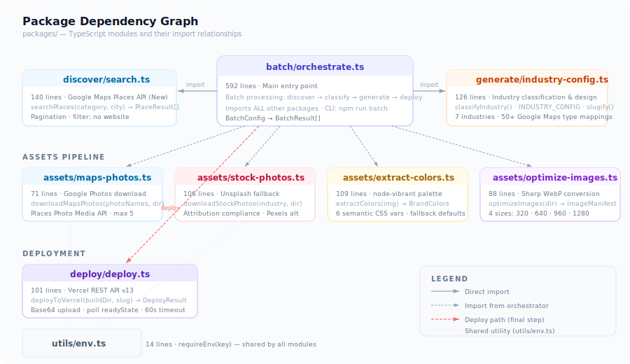
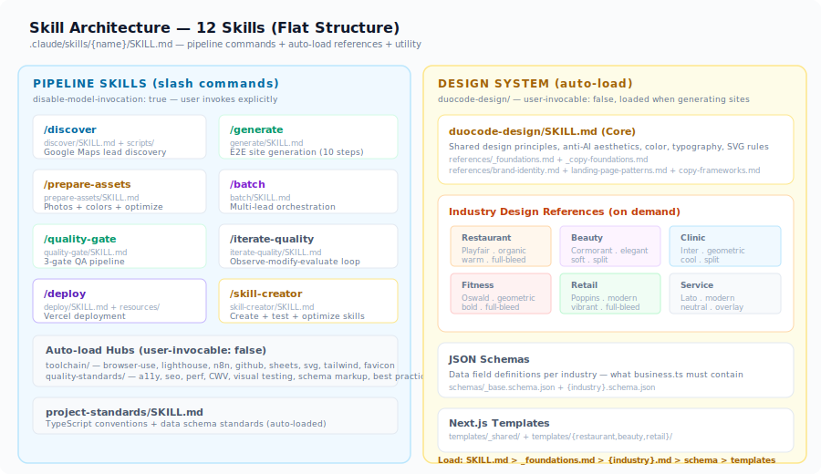

# DuoCode Pipeline

**Automated business website generation pipeline** — discovers businesses without websites via Google Maps, generates multilingual Next.js landing pages with industry-specific design, and deploys to Vercel with quality gates.

One command turns a Google Maps search into a live, production-grade website.

```
npm run batch -- --city "Kuala Lumpur" --categories "restaurant,beauty" --batch-size 3
```

---

## System Architecture

<picture>
  
</picture>

The pipeline is orchestrated by Claude Code as a central brain. Every phase — discovery, classification, generation, deployment — is driven programmatically through TypeScript modules under `packages/`.

### How It Works

1. **Discover** — Search Google Maps Places API for businesses without websites in a target city
2. **Classify** — Map the business's Google `primaryType` to one of 7 industry categories
3. **Generate** — Download photos, extract brand colors, copy templates, generate multilingual content, build with Next.js, run quality gates
4. **Deploy** — Push to GitHub (DuoCode2 org) and deploy via Vercel REST API

Each generated site ships with:
- 4 language versions (English, Malay, Simplified Chinese, Traditional Chinese)
- Brand colors extracted from the business's own photos
- Responsive images in 4 WebP sizes (320/640/960/1280)
- Industry-specific design (fonts, layout, SVG decorations)
- Perfect accessibility score (Lighthouse a11y = 100)

---

## Data Flow

<picture>
  
</picture>

---

## Project Structure

```
infra/src/
├── packages/                        # Core TypeScript pipeline modules
│   ├── discover/search.ts           # Google Maps Places API integration
│   ├── assets/
│   │   ├── maps-photos.ts           # Download business photos from Maps
│   │   ├── stock-photos.ts          # Unsplash/Pexels fallback photos
│   │   ├── extract-colors.ts        # node-vibrant → 6 CSS brand colors
│   │   └── optimize-images.ts       # Sharp → 4 WebP responsive sizes
│   ├── generate/industry-config.ts  # Industry classification + design config
│   ├── batch/orchestrate.ts         # Main orchestrator (592 lines)
│   ├── deploy/deploy.ts             # Vercel REST API v13 deployment
│   └── utils/env.ts                 # requireEnv() helper
│
├── .claude/skills/                  # 12 Claude Code skills (flat structure)
│   ├── generate/SKILL.md           #   /generate — E2E site generation
│   ├── batch/SKILL.md              #   /batch — multi-lead orchestration
│   ├── discover/SKILL.md           #   /discover — Google Maps lead discovery
│   ├── prepare-assets/SKILL.md     #   /prepare-assets — photos + colors
│   ├── quality-gate/SKILL.md       #   /quality-gate — 3-gate QA pipeline
│   ├── iterate-quality/SKILL.md    #   /iterate-quality — design improvement loop
│   ├── deploy/SKILL.md             #   /deploy — Vercel deployment
│   ├── duocode-design/             #   Auto-load: design system
│   │   ├── SKILL.md                #     Core design principles
│   │   ├── references/             #     7 industry guides + brand + landing page
│   │   ├── schemas/                #     JSON Schema per industry
│   │   └── templates/              #     Next.js templates (_shared + industry)
│   ├── toolchain/                  #   Auto-load: tool documentation hub
│   │   └── references/             #     browser-use, lighthouse, n8n, github...
│   ├── quality-standards/          #   Auto-load: quality standards hub
│   │   └── references/             #     a11y, seo, performance, CWV...
│   ├── project-standards/SKILL.md  #   Auto-load: code conventions + data schema
│   └── skill-creator/SKILL.md      #   Skill creation and testing
│
├── n8n/                             # Workflow engine (Docker)
│   ├── docker-compose.yml           # n8n + Evolution API (Phase 5)
│   ├── Dockerfile                   # Custom n8n with npm packages
│   └── *.json                       # 6 workflow definitions
│
├── output/                          # Generated sites (one per place_id)
│   └── {place_id}/
│       ├── src/data/business.ts     #   Generated: 4-language content
│       ├── public/images/           #   Optimized WebP photos
│       ├── public/svgs/             #   Industry SVG decorations
│       └── out/                     #   Next.js static export → deploy
│
├── tests/                           # Test suite
│   ├── run-all.sh                   #   7-group comprehensive test (300+ checks)
│   └── *.test.ts                    #   API, env, discover, assets, deploy tests
│
├── eval/                            # Evaluation scripts
│   ├── validate-skills.sh           #   Skill structure & frontmatter
│   ├── validate-templates.sh        #   Template completeness
│   └── quality-metrics.sh           #   Lighthouse config validation
│
├── package.json                     # Dependencies & scripts
├── tsconfig.json                    # TypeScript strict, ES2020
├── .lighthouserc.json               # Quality thresholds
└── .env.template                    # Required API keys
```

---

## Package Dependency Graph

<picture>
  
</picture>

### Module Details

| Module | Lines | Purpose | Key Export |
|--------|------:|---------|------------|
| `batch/orchestrate.ts` | 592 | Main orchestrator — runs full pipeline per lead | `batch(config)` |
| `discover/search.ts` | 140 | Google Maps Places API (New) search | `searchPlaces(category, city)` → `PlaceResult[]` |
| `generate/industry-config.ts` | 126 | Industry classification + design specs | `classifyIndustry()`, `INDUSTRY_CONFIG`, `slugify()` |
| `assets/extract-colors.ts` | 109 | Brand color extraction via node-vibrant | `extractColors(img)` → `BrandColors` |
| `assets/stock-photos.ts` | 106 | Unsplash/Pexels stock photo fallback | `downloadStockPhotos(industry, dir)` |
| `assets/optimize-images.ts` | 88 | Sharp WebP conversion at 4 breakpoints | `optimizeImages(dir)` → `ImageManifest` |
| `assets/maps-photos.ts` | 71 | Google Places photo download | `downloadMapsPhotos(names, dir)` |
| `deploy/deploy.ts` | 101 | Vercel REST API v13 deployment | `deployToVercel(buildDir, slug)` → `DeployResult` |
| `utils/env.ts` | 14 | Environment variable validation | `requireEnv(key)` |

### Key TypeScript Interfaces

```typescript
// PlaceResult — from Google Maps Places API
interface PlaceResult {
  id: string;
  displayName: { text: string; languageCode: string };
  primaryType?: string;          // e.g., "restaurant", "beauty_salon"
  formattedAddress: string;
  nationalPhoneNumber?: string;
  websiteUri?: string;           // null → target lead
  rating?: number;
  photos?: Array<{ name: string; widthPx: number; heightPx: number }>;
  googleMapsUri?: string;
}

// BrandColors — extracted from business photos
interface BrandColors {
  primary: string;      // Vibrant swatch
  primaryDark: string;  // DarkVibrant
  accent: string;       // LightVibrant
  surface: string;      // LightMuted
  textTitle: string;    // DarkMuted
  textBody: string;     // Muted
}

// IndustryDesign — per-industry visual specs
interface IndustryDesign {
  fontDisplay: string;    // e.g., "Playfair Display"
  fontBody: string;       // e.g., "Source Serif Pro"
  svgStyle: 'organic' | 'elegant' | 'geometric' | 'modern';
  colorWarmth: 'warm' | 'soft' | 'cool' | 'vibrant' | 'bold' | 'neutral' | 'from-photo';
  heroStyle: 'full-bleed' | 'split' | 'overlay';
  ctaStyle: 'rounded' | 'pill' | 'square';
}
```

---

## Skill Architecture

<picture>
  
</picture>

12 Claude Code skills in a flat structure under `.claude/skills/`:

**Pipeline Skills** (user-invoked via `/slash-commands`):
`/generate`, `/batch`, `/discover`, `/prepare-assets`, `/quality-gate`, `/iterate-quality`, `/deploy`

**Reference Skills** (Claude auto-loads when relevant):
`duocode-design` (design system), `toolchain` (tool docs hub), `quality-standards` (quality docs hub), `project-standards` (code conventions)

**Utility Skill**: `/skill-creator`

### Load Order (per site generation)

```
1. generate/SKILL.md              → orchestration steps (10-step process)
2. duocode-design/SKILL.md        → shared design principles (auto-loaded)
3. duocode-design/references/{industry}.md  → industry-specific design
4. duocode-design/schemas/{industry}.schema.json → data field requirements
```

### Industry Design Matrix

| Industry | Display Font | Body Font | SVG Style | Hero Layout | CTA Style |
|----------|-------------|-----------|-----------|-------------|-----------|
| Restaurant | Playfair Display | Source Serif Pro | organic | full-bleed | rounded |
| Beauty | Cormorant Garamond | Quicksand | elegant | split | pill |
| Clinic | Inter | DM Sans | geometric | split | square |
| Retail | Poppins | Inter | modern | full-bleed | rounded |
| Fitness | Oswald | Barlow | geometric | full-bleed | square |
| Service | Lato | Open Sans | modern | overlay | rounded |
| Generic | Playfair Display | Source Sans 3 | modern | overlay | rounded |

---

## Quality Gates

Every generated site must pass 3 gates before deployment:

| Gate | Tool | Thresholds | Config |
|------|------|------------|--------|
| **Gate 1** | `npm run build` | Zero TypeScript/build errors | `tsconfig.json` |
| **Gate 2** | Lighthouse CI | Performance ≥ 90, Accessibility = 100, SEO ≥ 95, Speed Index ≤ 3000ms, LCP ≤ 2500ms, CLS ≤ 0.1 | `.lighthouserc.json` |
| **Gate 3** | browser-use / Playwright | Visual QA score ≥ 75/100 (desktop + mobile screenshots) | — |

---

## External Services

| Service | Purpose | Auth | Used By |
|---------|---------|------|---------|
| Google Maps Places API (New) | Business discovery + photo download | `GOOGLE_API_KEY` | `discover/search.ts`, `assets/maps-photos.ts` |
| Google Sheets | Lead storage + work logging | n8n OAuth2 | n8n workflows |
| Gemini 2.5 Flash | Industry classification (via n8n) | `GOOGLE_API_KEY` | n8n `classify-industry.json` |
| Unsplash | Stock photo fallback | `UNSPLASH_ACCESS_KEY` | `assets/stock-photos.ts` |
| Pexels | Secondary stock photo source | `PEXELS_API_KEY` | `assets/stock-photos.ts` |
| Vercel | Static hosting + CDN | `VERCEL_TOKEN` | `deploy/deploy.ts` |
| GitHub | Source code storage (DuoCode2 org) | `gh` CLI auth | `batch/orchestrate.ts` |
| n8n | Workflow orchestration | Basic Auth | Docker (port 5678) |

### n8n Workflows

| Workflow | Webhook Endpoint | Purpose |
|----------|-----------------|---------|
| `prepare-assets.json` | `POST /webhook/prepare-assets` | Photo download + color extraction + optimization |
| `log-work.json` | `POST /webhook/log-work` | Log generation results to Google Sheets |
| `lead-status.json` | `POST /webhook/lead-status` | Update lead status in Sheets |
| `lead-discovery.json` | — | Discover leads via Maps API |
| `deploy-vercel.json` | — | Trigger Vercel deployment |
| `classify-industry.json` | — | Gemini-based industry classification |

---

## Commands

### Pipeline

```bash
# Discover businesses without websites
npm run discover -- --city "Kuala Lumpur" --category "restaurant" --limit 1

# Run full batch pipeline (discover → generate → deploy)
npm run batch -- --city "Kuala Lumpur" --categories "restaurant,beauty" --batch-size 2

# Individual asset operations
npx tsx packages/assets/extract-colors.ts --image path/to/photo.jpg --output output/test
npx tsx packages/assets/optimize-images.ts --input output/test/public/images

# Deploy a built site
npx tsx packages/deploy/deploy.ts --build-dir output/{place_id}/out --slug business-name
```

### Testing

```bash
npm test                  # API keys + env + discover (quick)
npm run test:all          # Full 7-group suite (300+ checks)
npm run test:keys         # Validate API key connectivity
npm run test:deploy       # Vercel deployment test
npm run build:check       # TypeScript compile check
```

### Evaluation

```bash
npm run eval:skills       # Skill structure validation (frontmatter, references)
npm run eval:templates    # Template completeness (components, industry coverage)
npm run eval:quality      # Quality metrics (Lighthouse config, thresholds)
npm run eval:all          # All evals + JSON report
```

### n8n (Docker)

```bash
cd n8n && docker compose up -d       # Start workflow engine
docker compose logs -f n8n           # Watch logs
curl http://localhost:5678/healthz   # Health check
```

---

## Tech Stack

| Layer | Technology | Version | Purpose |
|-------|-----------|---------|---------|
| **Runtime** | Node.js | — | TypeScript execution |
| **Language** | TypeScript | 5.9 | Strict mode, ES2020 target |
| **Framework** | Next.js | 14.2 | Static site generation |
| **Styling** | Tailwind CSS | 3.4 | Utility-first CSS |
| **Image Processing** | Sharp | 0.34 | WebP conversion, responsive sizes |
| **Color Extraction** | node-vibrant | 4.0 | Palette extraction from photos |
| **SVG Optimization** | SVGO | 4.0 | SVG minification |
| **Quality** | Lighthouse | 13.0 | Performance/a11y/SEO auditing |
| **Workflows** | n8n | 1.76 | Docker-based workflow orchestration |
| **Hosting** | Vercel | — | Static CDN + serverless |
| **Source Control** | GitHub | — | DuoCode2 org, `gh` CLI |
| **Orchestration** | Claude Code | — | Central pipeline brain |

---

## Environment Setup

```bash
# 1. Clone and install
git clone <repo-url> && cd infra/src
npm install

# 2. Configure environment
cp .env.template .env
# Fill in: GOOGLE_API_KEY, UNSPLASH_ACCESS_KEY, VERCEL_TOKEN, etc.

# 3. Verify setup
npm test

# 4. Start n8n (optional, for webhook-based workflows)
cd n8n && docker compose up -d

# 5. Run pipeline
npm run batch -- --city "Kuala Lumpur" --categories "restaurant" --batch-size 1
```

### Required API Keys

| Key | Provider | Required APIs |
|-----|----------|--------------|
| `GOOGLE_API_KEY` | [Google Cloud Console](https://console.cloud.google.com/apis/credentials) | Places API (New) + Generative Language API |
| `UNSPLASH_ACCESS_KEY` | [Unsplash Developers](https://unsplash.com/oauth/applications) | Image search |
| `PEXELS_API_KEY` | [Pexels API](https://www.pexels.com/api/new/) | Fallback photos |
| `VERCEL_TOKEN` | [Vercel Account](https://vercel.com/account/tokens) | Full Access scope |

---

## Generated Site Structure

Each site produced by the pipeline:

```
output/{place_id}/
├── src/
│   ├── app/[locale]/page.tsx        # Industry-specific page layout
│   ├── components/                  # 12+ shared components
│   │   ├── Header.tsx               #   Navigation + language switcher
│   │   ├── Hero.tsx                 #   Full-bleed / split / overlay
│   │   ├── Menu.tsx                 #   Restaurant: multi-language menu
│   │   ├── Services.tsx             #   Beauty: service catalog
│   │   ├── Reviews.tsx              #   Star ratings + testimonials
│   │   ├── Hours.tsx                #   Operating hours from Maps
│   │   ├── Location.tsx             #   Address + embedded map
│   │   ├── ContactForm.tsx          #   Lead capture form
│   │   ├── ResponsiveImage.tsx      #   srcset with image manifest
│   │   └── LanguageSwitcher.tsx     #   en / ms / 中文 / 中文
│   ├── data/business.ts             # All business content (4 languages)
│   └── styles/globals.css           # CSS variables from brand colors
├── public/
│   ├── images/*-{320,640,960,1280}.webp
│   └── svgs/*.svg                   # Industry decorations
├── brand-colors.json                # Extracted color palette
├── package.json                     # Next.js 14 + React 18 + Tailwind 3
└── out/                             # Static build → deployed to Vercel
```

---

## License

AGPL-3.0 for DuoCode-authored code. Third-party skills retain their original licenses.
